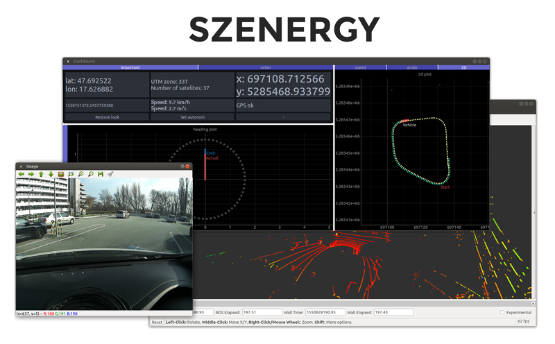
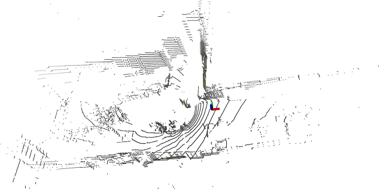
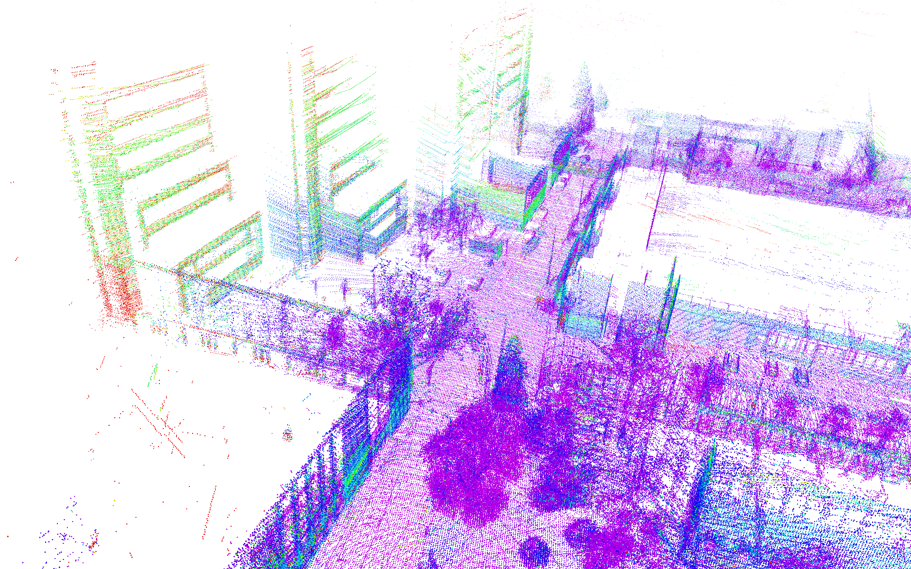
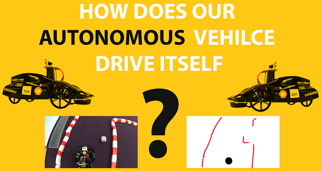
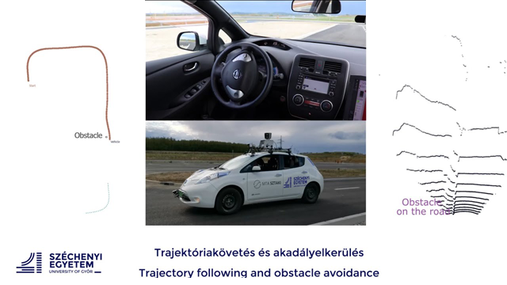

# Szenergy public resources
This repository is devoted to share data related to the Shell Eco-marathon __Autonomous__ Urban Concept (AUC) challange. 

#### Table of contents:
- [Datasets](#datasets) to download
- [Simulations](#simulations)
- [Algorithms](#algorithms)
- [Videos](#videos)
- [Papers](#papers)

## Datasets

- The data is available: 
#  [www.sze.hu/~herno/PublicDataAutonomous](http://www.sze.hu/~herno/PublicDataAutonomous/)

- The log data is in `.bag` format, the standard logging format for ROS and it can be also imported to MATLAB. The postprocessed 3d pointcloud data is in `.pcd` (Point Cloud Data) file format, it is a common format used inside Point Cloud Library (PCL). Also this can be imported easily to MATLAB. 

- The different rosbag files contain different topics, but the most important topics of the rosbag files are:

  - `/gps/odom`: position in xyz and orientation xyzw (message type: `nav_msgs/Odometry`)
  - `/gps/status`: the sum of all visible satelites (message type: `sensor_msgs/NavSatStatus`)
  - `/gps/kvhstatus`: sum of all kvh gps error, so 0 is means no errors (message type: `std_msgs/Int8`)
  - `/gps/fix`: timestamp, latitude, longitude, altitude (message type: `sensor_msgs/NavSatFix`)
  - `/gps/utmzone`: the utm zone, it should be `33T` in Hungary (message type: `std_msgs/String`)
  - `/gps/current_pose`: the current pose (message type: `geometry_msgs/PoseStamped`)
  - `/velodyne_points`: the point cloud of the Velodyne Puck VLP16 LIDAR (message type: `sensor_msgs/PointCloud2`)
  - `/leaf/current_velocity`: the current velocity from CAN (message type: ` geometry_msgs/TwistStamped`)
  - `/leaf/is_autonomous`: weather it is autonomous (message type: `std_msgs/Bool`)
  - `/leaf/throttle_pos`: percentage of the throttle (message type: `std_msgs/Float64`)
  - `/lane_waypoints_array`: lane waypoints from autoware (message type: `autoware_msgs/LaneArray`)
  - `/global_waypoints_mark`: autoware global waypoints (message type: `visualization_msgs/MarkerArray`)
  - `/local_waypoints_mark`: autoware local waypoints (message type: `visualization_msgs/MarkerArray`)
  - `/camera_image`: the camera image (message type: `sensor_msgs/CompressedImage`)

## Simulations

- In this section Gazebo and V-REP simulations will be available.

## Algorithms

- We contributed to the popular PythonRobotics repository (by Atsushi Sakai) [github.com/AtsushiSakai/PythonRobotics](https://github.com/AtsushiSakai/PythonRobotics/). Our example shows how to convert a 2D range measurement (e.g. LIDAR measurement) to occupancy grid map.

## Videos

Visit [youtube.com/szenergyteam](https://www.youtube.com/szenergyteam) for more videos and subscribe if you wish ;)

| Description  | Link  | Image  |
|-|:-:|:-:|
| Visualization of rosbag LIDAR data  | [youtu.be/Y2d54KxOrNI](https://www.youtube.com/watch?v=Y2d54KxOrNI)  |   |
| Pointcloud of the Széchenyi Campus (Győr, Hungary)  | [youtu.be/kTf-VvokQH8](https://www.youtube.com/watch?v=kTf-VvokQH8)  |  |
| Explanatory video about the autonomous model vehicle (2018)  | [youtu.be/zWccR52v7JU](https://www.youtube.com/watch?v=zWccR52v7JU)  |   |
| Autonomous obstacle avoidance with Nissan Leaf  | [youtu.be/inBcf-J6LSM](https://www.youtube.com/watch?v=inBcf-J6LSM)  |   |

## Papers

- Papers will be available later.
