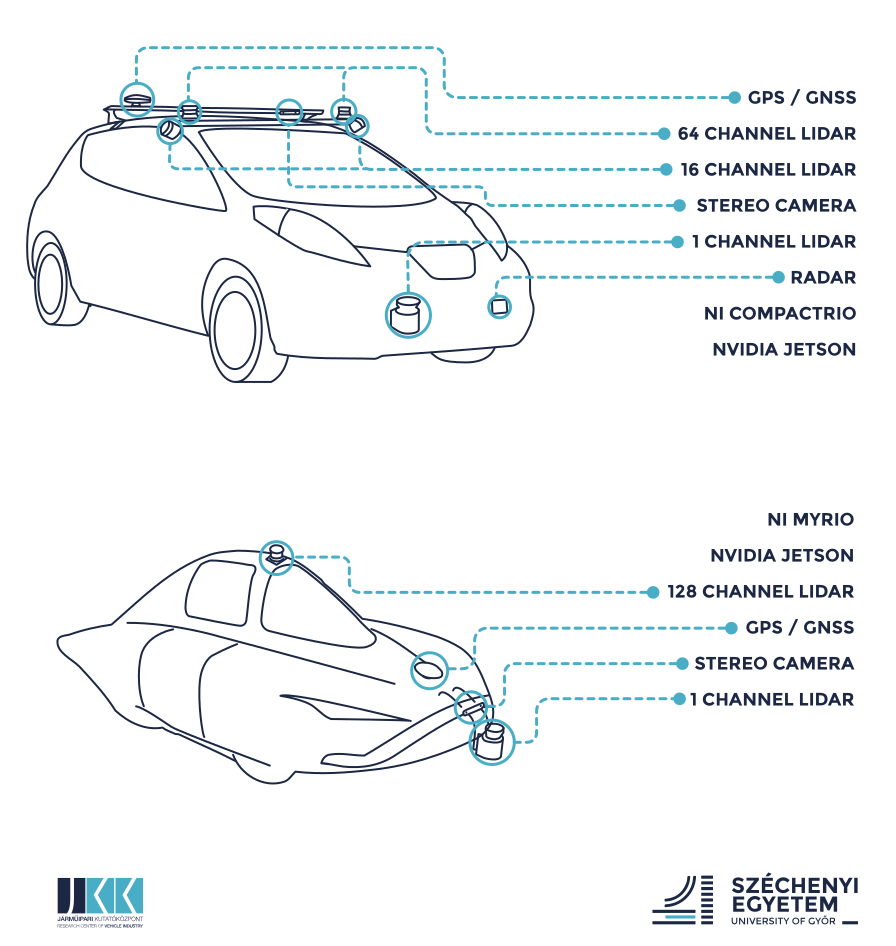
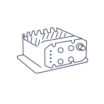
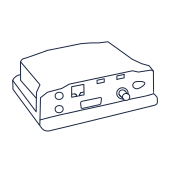
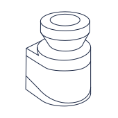
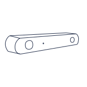
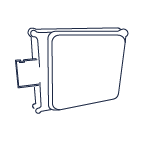
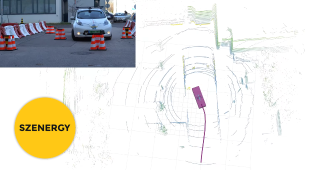

# Szenergy public resources
This repository is devoted to share data related to the Shell Eco-marathon __Autonomous__ Urban Concept (AUC) challange. 

#### Table of contents:
- [Datasets](#datasets) to download
- [Hardware](#hardware)
- [Simulations](#simulations)
- [Algorithms](#algorithms)
- [Videos](#videos)
- [Papers](#papers)

## Datasets

- The data is available: 
  ### [www.sze.hu/~herno/PublicDataAutonomous](http://www.sze.hu/~herno/PublicDataAutonomous/)

- The log data is in `.bag` format, the standard logging format for ROS and it can be also imported to MATLAB. The postprocessed 3d pointcloud data is in `.pcd` (Point Cloud Data) file format, it is a common format used inside Point Cloud Library (PCL). Also this can be imported easily to MATLAB. 

## Hardware

During the project several sensor constellations were tested. [This link](https://github.com/search?q=topic%3Adriver+fork%3Atrue+org%3Aszenergy&type=Repositories) contains the public repositories shared by Szenergy. The latest sensor constellation is visible in the following image. In the top the research-purposed Nissan Leaf, at the bottom the education-purposed Szenergy vehicle is illustrated. This is the current version of the vehicles. 

Follow [this link](https://github.com/search?q=topic%3Adriver+fork%3Atrue+org%3Aszenergy&type=Repositories) to our public drivers.

| Image | Type | Device | External link |
| --- | --- | --- | --- |
|  | GPS | SwiftNav Duro Inertial | [github.com/szenergy/duro_gps_driver](https://github.com/szenergy/duro_gps_driver) | 
|  | GPS | NovAtel PW7720E1-DDD-RZN-TBE-P1 | [github.com/szenergy/novatel_gps_driver](https://github.com/szenergy/novatel_gps_driver) |
|  | GPS | KVH Geo Fog 3D | [github.com/szenergy/kvh_gps_driver](https://github.com/szenergy/kvh_gps_driver) |
|  | LIDAR | Velodyne VLP16 Puck | [github.com/szenergy/nissan_leaf_ros](https://github.com/szenergy/nissan_leaf_ros) |
|  | LIDAR | Ouster OS1-64, OS1-128  | [github.com/szenergy/ouster_example](https://github.com/szenergy/ouster_example) |
|  | LIDAR | Sick LMS111  | [github.com/clearpathrobotics/lms1xx](https://github.com/clearpathrobotics/lms1xx) | 
|  | Camera | Stereolabs ZED | [github.com/stereolabs/zed-ros-wrapper](https://github.com/stereolabs/zed-ros-wrapper) | 
|  | Radar | Continental ARS 408 |  

## Simulations

- In this section Gazebo and V-REP simulations will be available.

## Algorithms and utilities

- We contributed to the popular PythonRobotics repository (by Atsushi Sakai) [github.com/AtsushiSakai/PythonRobotics](https://github.com/AtsushiSakai/PythonRobotics/). Our example shows how to convert a 2D range measurement (e.g. LIDAR measurement) to occupancy grid map.
- Trajectory following approaches written in C++ with ROS compatibility: [multi goal pure-pursuit](https://github.com/szenergy/szenergy-path-tracking)
- TF publisher from GPS in ROS: [github.com/szenergy/szenergy-utility-programs/tree/master/gps_tf_publisher](https://github.com/szenergy/szenergy-utility-programs/tree/master/gps_tf_publisher)
- Rosbag scripts: [github.com/szenergy/szenergy-utility-programs/tree/master/bag_scripts](https://github.com/szenergy/szenergy-utility-programs/tree/master/bag_scripts)

## Videos

Visit [youtube.com/szenergyteam](https://www.youtube.com/szenergyteam) for more videos and subscribe if you wish ;)

| Description  | Link  | Image  |
|-|:-:|:-:|
| Visualization of rosbag LIDAR data  | [youtu.be/Y2d54KxOrNI](https://www.youtube.com/watch?v=Y2d54KxOrNI)  |   |
| Pointcloud of the Széchenyi Campus (Győr, Hungary)  | [youtu.be/kTf-VvokQH8](https://www.youtube.com/watch?v=kTf-VvokQH8)  |  |
| Explanatory video about the autonomous model vehicle (2018)  | [youtu.be/zWccR52v7JU](https://www.youtube.com/watch?v=zWccR52v7JU)  |   |
| Autonomous obstacle avoidance with Nissan Leaf  | [youtu.be/inBcf-J6LSM](https://www.youtube.com/watch?v=inBcf-J6LSM)  |   |
| LIDAR test measurements before Shell Eco-marathon Autonomous UrbanConcept | [youtu.be/LldFZQLgEfA](https://www.youtube.com/watch?v=LldFZQLgEfA)  |   |

## Papers

- [Towards System-Level Testing with Coverage Guarantees for Autonomous Vehicles](https://ieeexplore.ieee.org/document/8906897) - *István Majzik; Oszkár Semeráth; Csaba Hajdu; Kristóf Marussy; Zoltán Szatmári; Zoltán Micskei; András Vörös; Aren A. Babikian; Dániel Varró* - ACM/IEEE 22nd International Conference on Model Driven Engineering Languages and Systems (MODELS) `2019`, Munich, Germany
- [Range Sensor-based Occupancy Grid Mapping with Signatures](https://ieeexplore.ieee.org/document/8765684) - *Ernő Horváth; Csaba Hajdu; Claudiu Radu; Áron Ballagi* - 20th International Carpathian Control Conference (ICCC), `2019`, Krakow-Wieliczka, Poland
- [Novel Pure-Pursuit Trajectory Following Approaches and their Practical Applications](https://ieeexplore.ieee.org/document/9089927) - *Ernő Horváth, Csaba Hajdu and Peter Kőrös* - 10th IEEE International Conference on InfoCommunications `2019`, Naples, Italy
- [Improve the Accuracy of Neural Networks using Capsule Layers](https://ieeexplore.ieee.org/document/8928194) - *János Hollósi, Claudiu Radu Pozna* - IEEE 18th International Symposium on Computational Intelligence and Informatics (CINTI), `2018`, Budapest, Hungary
